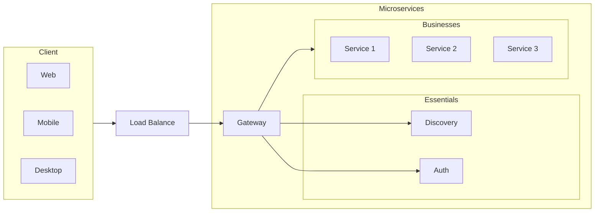
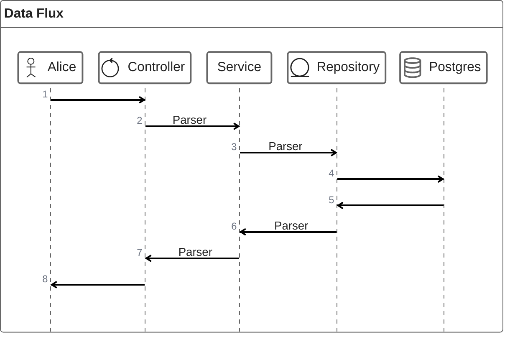

## Microsserviços

**Microserviços** são uma abordagem de arquitetura de software em que uma aplicação é composta por pequenos serviços independentes, cada um com uma função específica e que se comunicam entre si, geralmente por meio de APIs (normalmente REST ou mensageria). Diferente da arquitetura monolítica, onde todos os componentes de uma aplicação são executados em uma única estrutura, os microserviços são distribuídos e independentes.

!!! Note "Características"

    - **Descentralização**: Cada serviço é desenvolvido, implementado e gerido de forma independente. Cada equipe pode ser responsável por um ou mais microserviços.
    
    - **Autonomia**: Cada microserviço tem seu próprio ciclo de vida, sendo versionado, testado e implementado de maneira isolada.

    - **Escalabilidade**: Os microserviços podem ser escalados individualmente. Se um serviço tiver mais demanda que os outros, apenas ele pode ser escalado sem a necessidade de escalar a aplicação inteira.

    - **Especialização**: Cada microserviço é projetado para realizar uma tarefa específica, o que permite que seja mais simples e eficiente em seu escopo limitado.

    - **Comunicação via APIs**: Normalmente, a comunicação entre os microserviços acontece via APIs RESTful, mas também pode ocorrer por mensageria, como RabbitMQ, Kafka ou outros sistemas de filas.

!!! Success "Vantagens"

    - **Escalabilidade independente**: Como os microserviços são independentes, é possível escalar apenas os serviços que necessitam de mais recursos. Isso otimiza o uso de infraestrutura e melhora a eficiência operacional.

    - **Facilidade de manutenção e desenvolvimento**: Como os microserviços são pequenos e focados em uma tarefa, é mais fácil compreender, manter e evoluir cada parte do sistema. Isso resulta em ciclos de desenvolvimento mais curtos e mais eficiência na adição de novas funcionalidades.

    - **Desenvolvimento e implantação paralelos**: Equipes podem trabalhar simultaneamente em diferentes microserviços sem interferir umas nas outras, o que acelera o desenvolvimento. Além disso, é possível fazer o deploy de um serviço individual sem afetar a aplicação inteira.

    - **Resiliência**: Um problema em um microserviço não necessariamente derruba toda a aplicação. O isolamento entre eles permite que falhas sejam contidas em um único serviço, mantendo o restante da aplicação funcionando.

    - **Flexibilidade tecnológica**: Cada microserviço pode ser desenvolvido em linguagens de programação diferentes ou com tecnologias diferentes, dependendo das necessidades específicas, sem impor uma única stack tecnológica para toda a aplicação.

    - **Reutilização**: Microserviços podem ser reutilizados em diferentes projetos ou contextos, o que promove uma economia de esforço no desenvolvimento de novas aplicações.

    - **Atualizações sem downtime**: Como os microserviços podem ser implantados de maneira independente, é possível atualizar partes da aplicação sem precisar derrubar o sistema inteiro.

!!! warning "Desafios"

    - **Complexidade de comunicação**: A comunicação entre microserviços pode ser um ponto complexo e exige atenção especial em relação à latência e consistência de dados.

    - **Gerenciamento de dados distribuídos**: Como cada microserviço pode ter seu próprio banco de dados, manter a consistência e integridade dos dados distribuídos pode ser desafiador.

    - **Orquestração e monitoração**: Em um ambiente com muitos microserviços, monitorar e orquestrar todos os serviços de maneira eficaz pode ser difícil. É necessário um bom sistema de monitoramento e logs distribuídos para garantir o bom funcionamento da aplicação como um todo.

    - **Gerenciamento de dependências**: A medida que os microserviços se interconectam, há a necessidade de gerenciar dependências entre eles, o que pode aumentar a complexidade.

Os microserviços são uma escolha popular para aplicações complexas, que precisam de escalabilidade e evolução constante. Eles se encaixam bem em ambientes de DevOps e na cultura de integração e entrega contínuas (CI/CD).

<figure markdown="span">
  
  <figcaption>Diagrama ilustrativo de uma arquitetura de microserviços, destacando conceitos como escalabilidade, resiliência, flexibilidade, autonomia e implantação independente. Fonte: Ilustração criada pelo <a href='https://chat.openai.com/' target='_blank'>ChatGPT</a> a partir de uma explicação técnica.</figcaption>
</figure>

Para conectar os microserviços e fazer com que operem com o mínimo de segurança é necessário implementar uma estratégica de acesso a todos os serviços. A figura abaixo ilustra a arquitetura de um sistema de microsserviços com um gateway de API.




## Arquitetura Limpa

Em uma solução de microsserviços, a arquitetura do sistema é dividida em camadas, onde cada camada tem uma responsabilidade específica. A arquitetura limpa é uma abordagem que propõe uma separação clara entre as camadas do sistema, de forma que a lógica de negócio seja independente de detalhes de implementação, como frameworks, bibliotecas ou banco de dados[^1].

<figure markdown="span">
  
  <figcaption>Ilustração dos conceitos de arquitetura limpa e suas "camadas". Fonte: <a href='https://blog.cleancoder.com/uncle-bob/2012/08/13/the-clean-architecture.html' target='_blank'>The Clean Architecture</a>.</figcaption>
</figure>



## Criando um Microsserviço com Spring Boot

Initializr é uma ferramenta web que permite que você crie rapidamente um projeto Spring Boot. Você pode selecionar as dependências que deseja incluir em seu projeto, como Spring Web, JPA, Spring Data MongoDB, entre outras.
[Intializr](https://start.spring.io/){:target='_blank'}

## Compilando com Maven

<!-- termynal -->

``` { bash }
> mvn clean package spring-boot:run
```


## Dockerizando o Microsserviço


## Referências

[^1]: [The Clean Architecture](https://blog.cleancoder.com/uncle-bob/2012/08/13/the-clean-architecture.html){target='_blank'}
[^2]: [Apache Maven Project](https://maven.apache.org/){target='_blank'}
[^3]: [Maven Repository](https://mvnrepository.com/){target='_blank'}
